## Probleem
De game 'Runner' zorgt voor wat afleiding en broodnodige ontspanning tijdens de lange studieuren op.

## Doelgroep
Studenten.

## Setting
Desktop & laptop studenten die van een paar rondes van een towergames houden tussen het studeren in de uba door.

## Samenvatting
Dit spel is een omgekeerde towergame. In plaats van torens plaatsen in een matrix om te verhinderen dat vijandelijke 
eenheden een bepaalde plek in de map bereiken is het nu aan de speler om zich een weg te banen door die map  
en zijn of haar eenheden op die bepaalde plek te krijgen. Afhankekelijk van de omvang van de map en de geselecteerde 
moeilijkheidsgraad zullen er per ronde nieuwe towers spawnen of upgraden en wordt de speler gedwongen een stuk toe  
te voegen aan de route naar het specifieke eindpunt van de map.

## Thema
Het thema is dystopisch en sci-fi georienteerd. Het is onduidelijk wie er achter het onstaan van de towers zit,  
maar het is wel duidelijk dat waar ze verschijnen je moet 'runnen' voor je leven. De towers hebben een architectuur 
die 

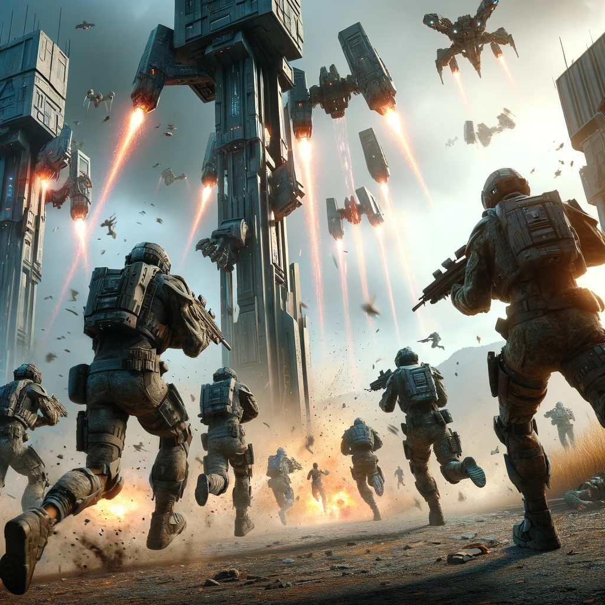
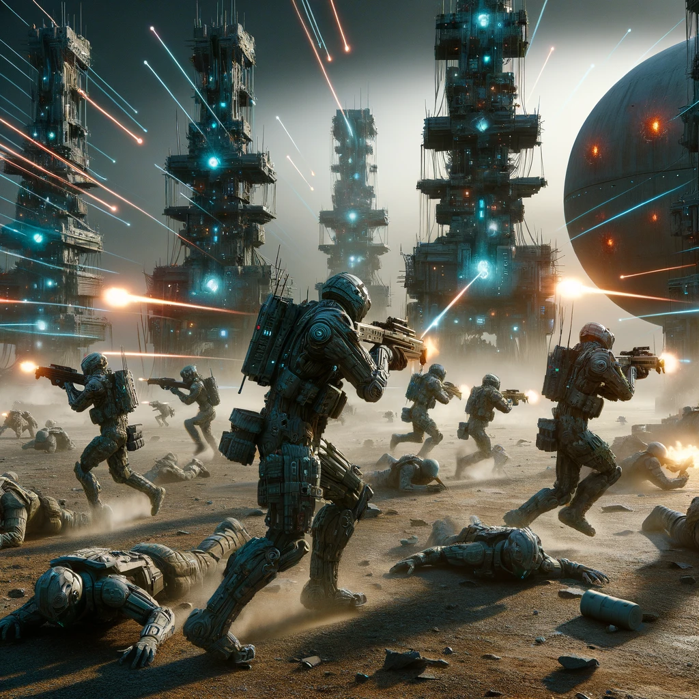
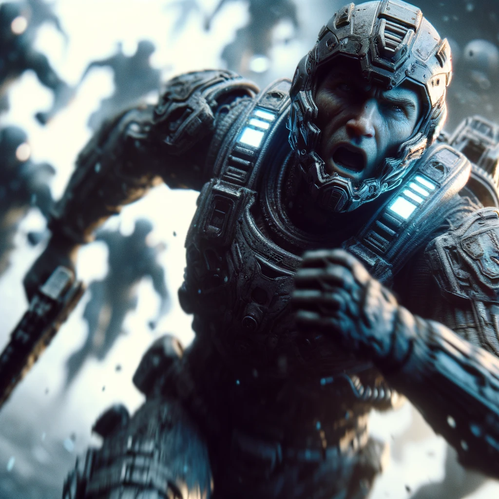
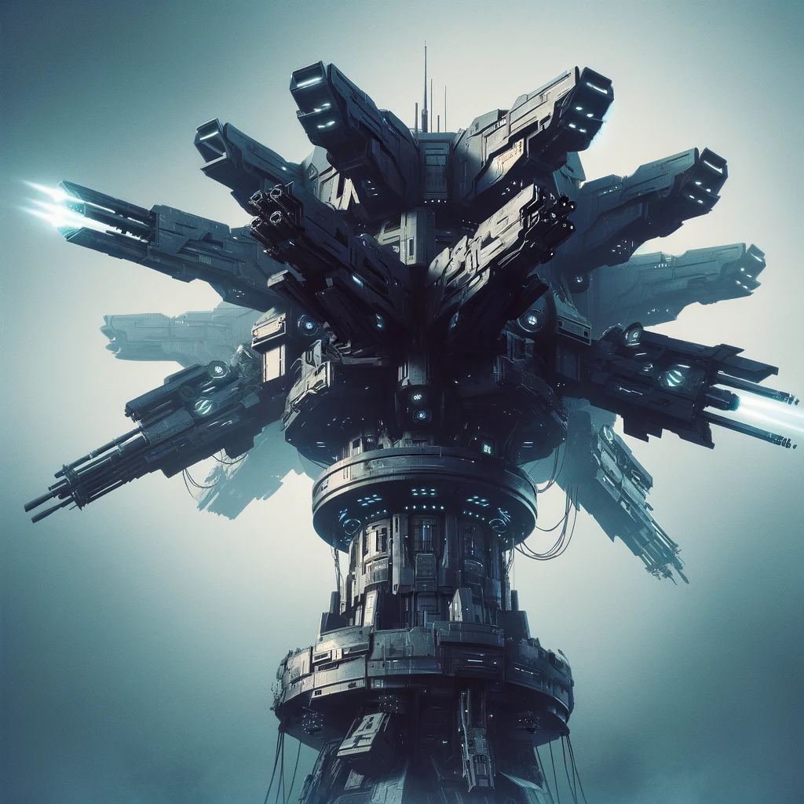
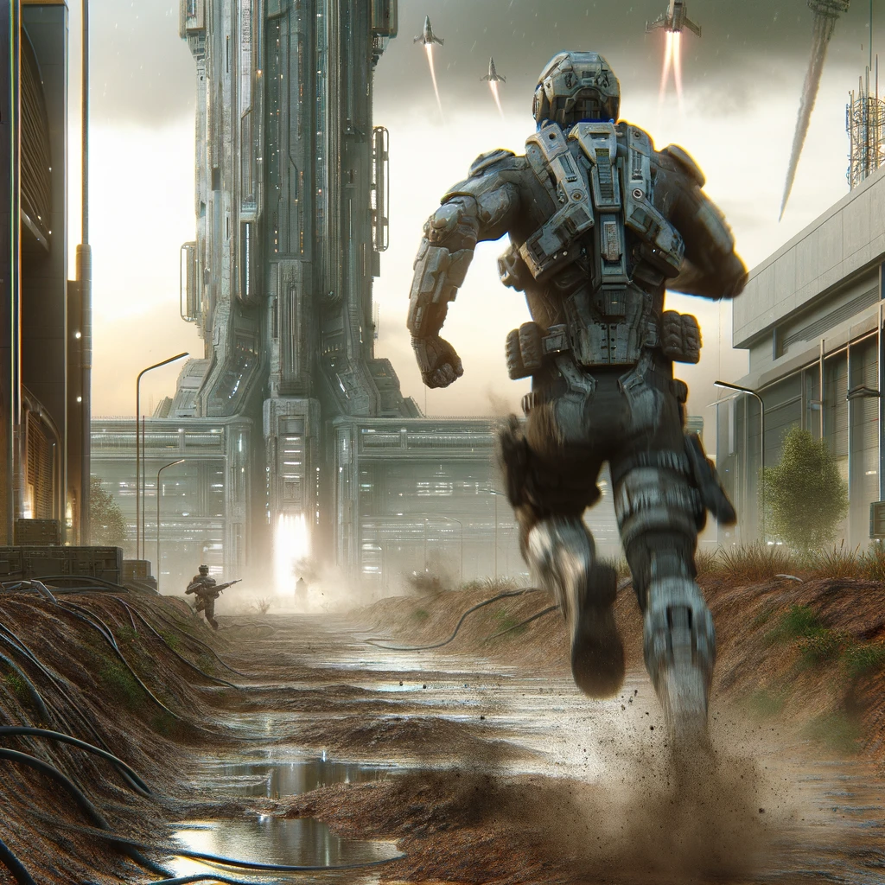

## Core Game Mechanics Diagram
### Core Mechanic
Making routes

### Secundairy Mechanics
Upgrade or expand runners

### Progression
Get enough runners to the end of the round, making money to improve survival odds

### Narrative
Survive the unslaught of the tyrannic towers

## Scope
Primair moet de gameplay goed in elkaar zitten. De mechanics moeten soepel lopen en er moet een uitdaging in het  
spel zitten. Secundair is de visuele presentatie. Er moet een wanhoopige sfeer worden gecreeerd, waar de speler zo 
goed als machteloos is, met als enige middel zoveel mpgelijk runners te laten overleven. 
Als de game mechanics niet goed werken word die sfeer niet goed overgebracht, dan heerst er vooral frustratie  
over de onspeelbaarheid. (benadrukken speebaarheid)

## Sketches
De game opent met een visual
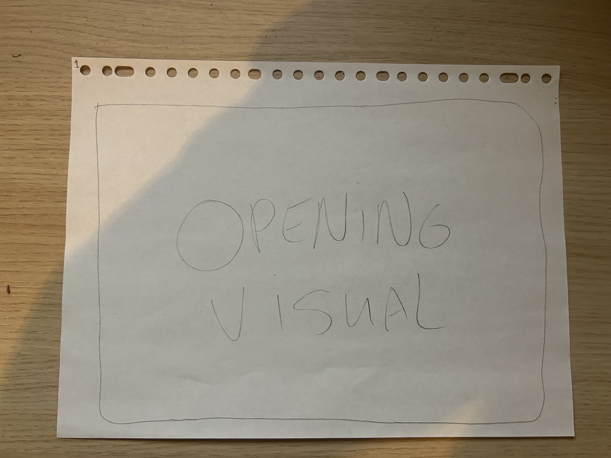
 
 
 
 
Over de visual heen komt het start menu, waar je een nieuw spel kunt starten of een bestaande laden
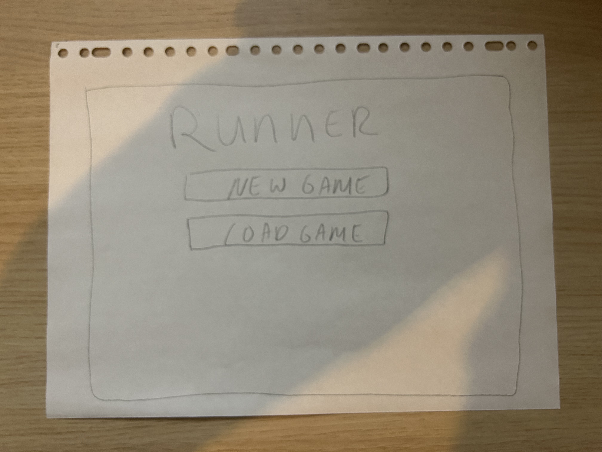
 
 
 
 
Als je 'new game' hebt aangeklikt, dan kom je in onderstaand scherm terecht waar je kunt aangeven hoe  
groot de map moet zijn. Dit bepaald ook welke score je moet halen om een ronde te winnen. De difficulty bepaald met  
Welke frequentie nieuwe torens worden geplaatst en/of geupgrade
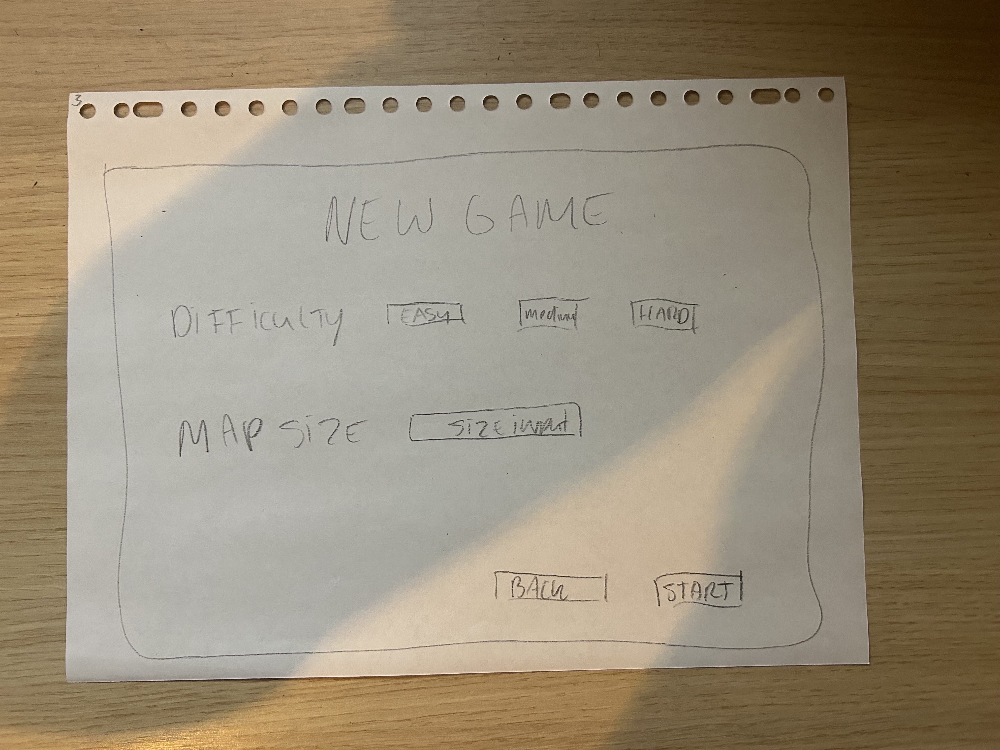
 
 
 
 
Indien je in het startscherm aangeeft dat je een bestaande ronde wilt laden, kom je in onderstaand scherm terecht. 
Selecteer de save in kwestie en speel het spel door.
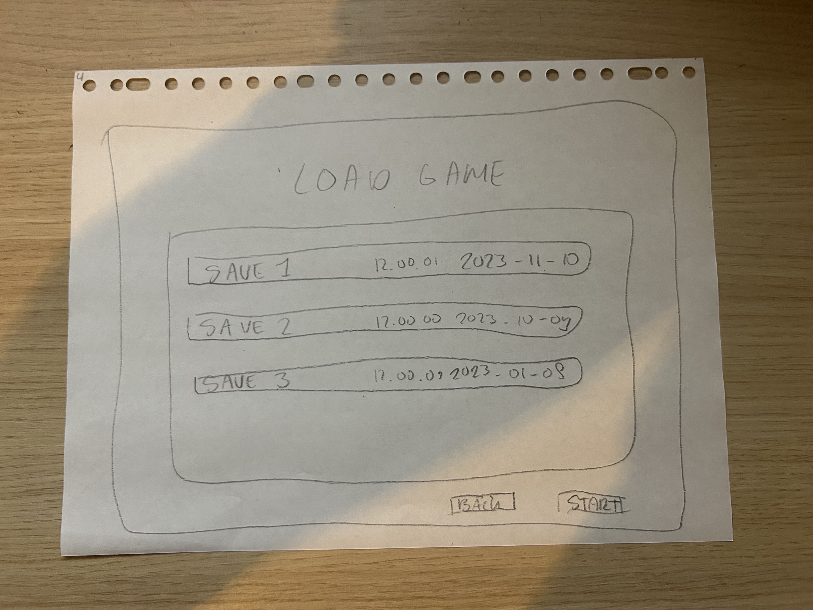
 
 
 
 
Voorbeeld van de aanvang van de eerste ronde van een level.
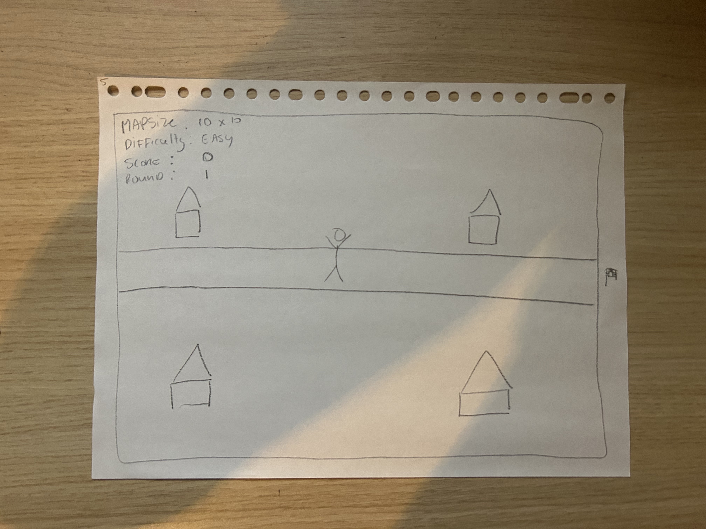
 
 
 
 
Voorbeeld van de tweede ronde van een level.
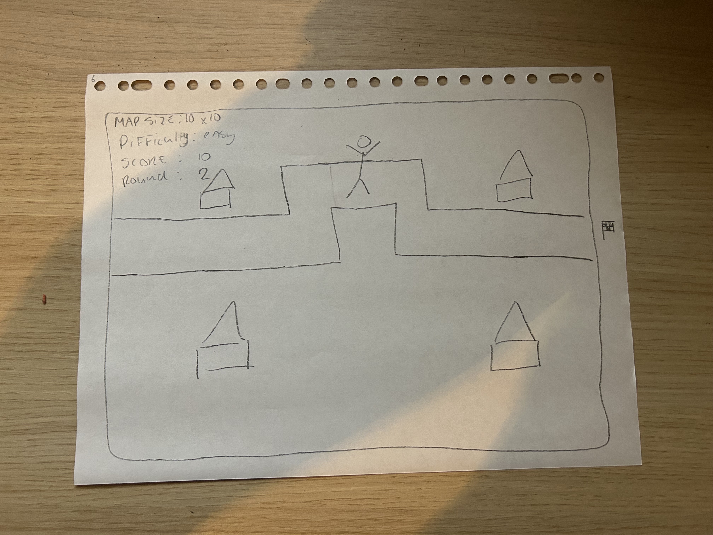
 
 
 
 
Voorbeeld van een aantal rondes na aanvang van het level
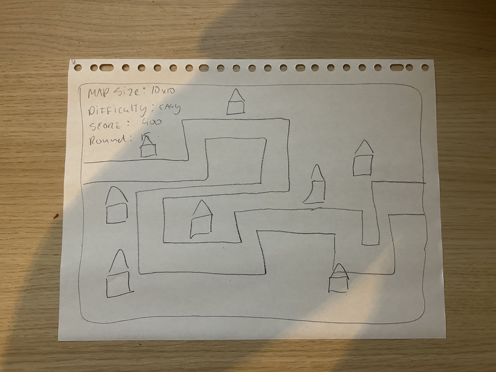

## Features
### Primaire features
- Difficulty generator
- Matrix generator
- Upgrades of the types of towers
- Round counter
- Score/survival counter
- End of round requirements
- Creating routes
- Tower generator
- Tower Upgrade generator
- Succes visual
- Lose Visual

### Secundaire features
- Start visual
- Save game
- Load Game
- Types of towers
- Pause

## Uitdaging
Vanwege de focus op gameplay wordt de mechanic achter het creeëren van de route en een gebalanceerde tower spawn 
voor iedere moeilijkheidsgraad vrij cruciaal. Daarnaast lijkt het me een uitdaging om de juiste sfeer neer te zetten.

## External components
- Tutorialvan Brakeys voor towergames
- Unity libraries (to be decided) voor de graphics

